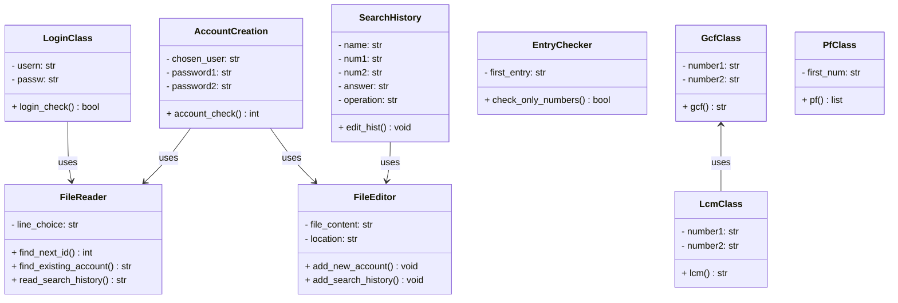
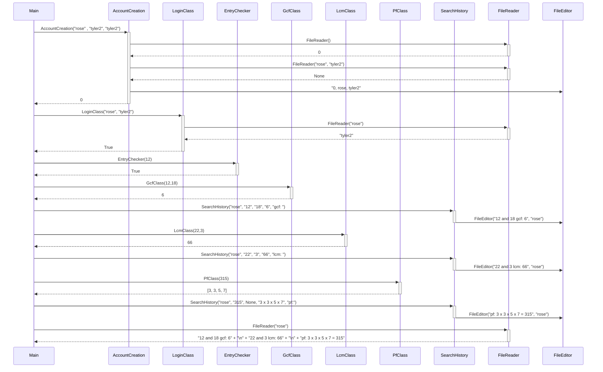

# Class Diagram

```mermaid
classDiagram
  class LoginClass {
    - usern: str
    - passw: str
    + login_check() bool
  }

  class AccountCreation {
    - chosen_user: str
    - password1: str
    - password2: str
    + account_check() int
  }

  class FileReader {
    - line_choice: str
    + find_next_id() int
    + find_existing_account() str
    + read_search_history() str
  }

  class FileEditor {
    - file_content: str
    - location: str
    + add_new_account() void
    + add_search_history() void
  }

  class SearchHistory {
    - name: str
    - num1: str
    - num2: str
    - answer: str
    - operation: str
    + edit_hist() void
  }

  class EntryChecker {
    - first_entry: str
    + check_only_numbers() bool
  }

  class GcfClass {
    - number1: str
    - number2: str
    + gcf() str
  }

  class LcmClass {
    - number1: str
    - number2: str
    + lcm() str
  }

  class PfClass {
    - first_num: str
    + pf() list
  }

  LoginClass --> FileReader: uses
  AccountCreation --> FileEditor: uses
  AccountCreation --> FileReader: uses
  SearchHistory --> FileEditor: uses
  GcfClass <-- LcmClass: uses

```

# Sequence Diagram

```mermaid
sequenceDiagram
  participant Main
  participant AccountCreation
  participant LoginClass
  participant EntryChecker
  participant GcfClass
  participant LcmClass
  participant PfClass
  participant SearchHistory
  participant FileReader
  participant FileEditor

  Main->>+AccountCreation: AccountCreation("rose" , "tyler2", "tyler2")
  AccountCreation->>+FileReader: FileReader()
  FileReader-->>-AccountCreation: 0
  AccountCreation->>+FileReader: FileReader("rose", "tyler2")
  FileReader-->>-AccountCreation: None
  AccountCreation->>FileEditor: "0, rose, tyler2"
  AccountCreation-->>-Main: 0

  Main->>+LoginClass: LoginClass("rose", "tyler2")
  LoginClass->>+FileReader: FileReader("rose")
  FileReader-->>-LoginClass: "tyler2"
  LoginClass-->>-Main: True

  Main->>+EntryChecker: EntryChecker(12)
  EntryChecker-->>-Main: True

  Main->>+GcfClass: GcfClass(12,18)
  GcfClass -->>-Main: 6

  Main->>+SearchHistory: SearchHistory("rose", "12", "18", "6", "gcf: ")
  SearchHistory->>-FileEditor: FileEditor("12 and 18 gcf: 6", "rose")

  Main->>+LcmClass: LcmClass(22,3)
  LcmClass -->>-Main: 66

  Main->>+SearchHistory: SearchHistory("rose", "22", "3", "66", "lcm: ")
  SearchHistory->>-FileEditor: FileEditor("22 and 3 lcm: 66", "rose")

  Main->>+PfClass: PfClass(315)
  PfClass -->>-Main: [3, 3, 5, 7]

  Main->>+SearchHistory: SearchHistory("rose", "315", None, "3 x 3 x 5 x 7", "pf:")
  SearchHistory->>-FileEditor: FileEditor("pf: 3 x 3 x 5 x 7 = 315", "rose")

  Main->>+FileReader: FileReader("rose")
  FileReader-->>-Main: "12 and 18 gcf: 6" + "\n" +  "22 and 3 lcm: 66" + "\n" + "pf: 3 x 3 x 5 x 7 = 315"

```

