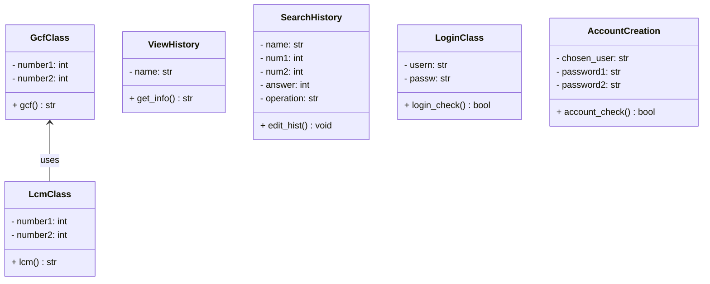

```mermaid
classDiagram
    class GcfClass {
        - number1: int
        - number2: int
        + gcf() str
    }

    class LcmClass {
        - number1: int
        - number2: int
        + lcm() str
    }

    class ViewHistory {
        - name: str
        + get_info() str
    }

    class SearchHistory {
        - name: str
        - num1: int
        - num2: int
        - answer: int
        - operation: str
        + edit_hist() void
    }

    class LoginClass {
        - usern: str
        - passw: str
        + login_check() bool
    }

    class AccountCreation {
        - chosen_user: str
        - password1: str
        - password2: str
        + account_check() bool
    }

    GcfClass <-- LcmClass : uses
```
