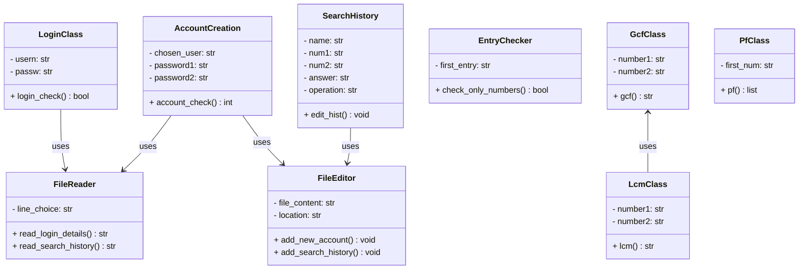

```mermaid
classDiagram
  class LoginClass {
    - usern: str
    - passw: str
    + login_check() bool
  }

  class AccountCreation {
    - chosen_user: str
    - password1: str
    - password2: str
    + account_check() int
  }

  class FileReader {
    - line_choice: str
    + read_login_details() str
    + read_search_history() str
  }

  class FileEditor {
    - file_content: str
    - location: str
    + add_new_account() void
    + add_search_history() void
  }

  class SearchHistory {
    - name: str
    - num1: str
    - num2: str
    - answer: str
    - operation: str
    + edit_hist() void
  }

  class EntryChecker {
    - first_entry: str
    + check_only_numbers() bool
  }

  class GcfClass {
    - number1: str
    - number2: str
    + gcf() str
  }

  class LcmClass {
    - number1: str
    - number2: str
    + lcm() str
  }

  class PfClass {
    - first_num: str
    + pf() list
  }

  LoginClass --> FileReader: uses
  AccountCreation --> FileEditor: uses
  AccountCreation --> FileReader: uses
  SearchHistory --> FileEditor: uses
  GcfClass <-- LcmClass: uses
```
