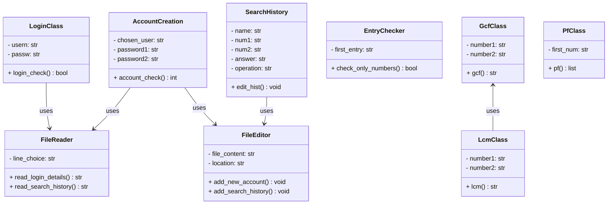
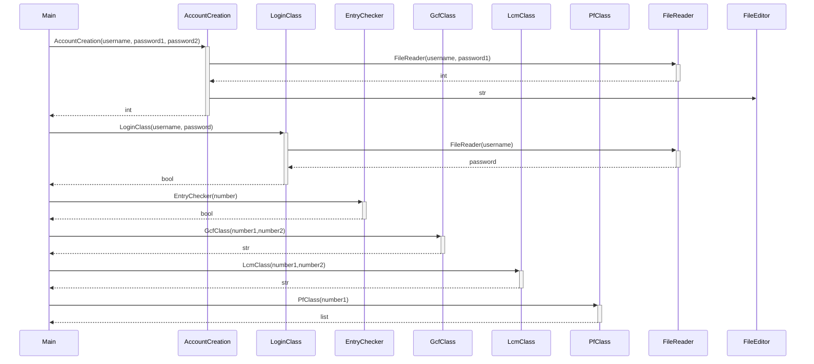

```mermaid
classDiagram
  class LoginClass {
    - usern: str
    - passw: str
    + login_check() bool
  }

  class AccountCreation {
    - chosen_user: str
    - password1: str
    - password2: str
    + account_check() int
  }

  class FileReader {
    - line_choice: str
    + read_login_details() str
    + read_search_history() str
  }

  class FileEditor {
    - file_content: str
    - location: str
    + add_new_account() void
    + add_search_history() void
  }

  class SearchHistory {
    - name: str
    - num1: str
    - num2: str
    - answer: str
    - operation: str
    + edit_hist() void
  }

  class EntryChecker {
    - first_entry: str
    + check_only_numbers() bool
  }

  class GcfClass {
    - number1: str
    - number2: str
    + gcf() str
  }

  class LcmClass {
    - number1: str
    - number2: str
    + lcm() str
  }

  class PfClass {
    - first_num: str
    + pf() list
  }

  LoginClass --> FileReader: uses
  AccountCreation --> FileEditor: uses
  AccountCreation --> FileReader: uses
  SearchHistory --> FileEditor: uses
  GcfClass <-- LcmClass: uses

```

```mermaid
sequenceDiagram
  participant Main
  participant AccountCreation
  participant LoginClass
  participant EntryChecker
  participant GcfClass
  participant LcmClass
  participant PfClass
  participant FileReader
  participant FileEditor

  Main->>+AccountCreation: AccountCreation(username, password1, password2)
  AccountCreation->>+FileReader: FileReader(username, password1)
  FileReader-->>-AccountCreation: int
  AccountCreation->>FileEditor: str
  AccountCreation-->>-Main: int

  Main->>+LoginClass: LoginClass(username, password)
  LoginClass->>+FileReader: FileReader(username)
  FileReader-->>-LoginClass: password
  LoginClass-->>-Main: bool

  Main->>+EntryChecker: EntryChecker(number)
  EntryChecker-->>-Main: bool

  Main->>+GcfClass: GcfClass(number1,number2)
  GcfClass -->>-Main: str

  Main->>+LcmClass: LcmClass(number1,number2)
  LcmClass -->>-Main: str

  Main->>+PfClass: PfClass(number1)
  PfClass -->>-Main: list

```

