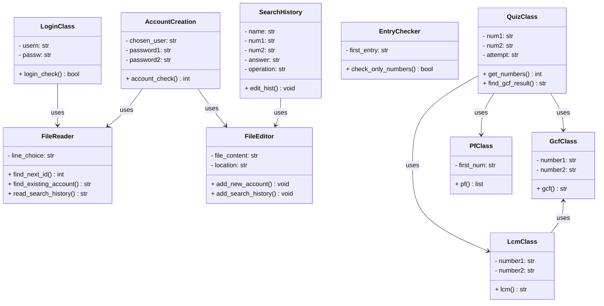
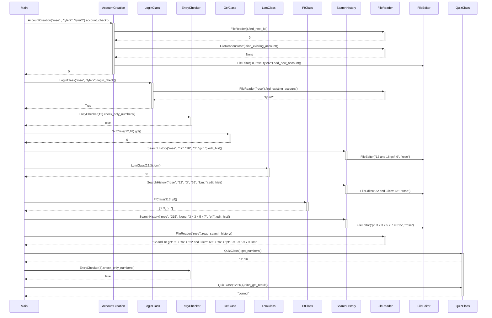

# Class Diagram

# Sequence Diagram

# File Descriptions 

### account_login.py:

This file contains the functionality for account creation and login. There are two classes in this file. 

The first is `LoginClass` which takes two user inputs. It calls the class `FileReader` which takes the first input (which is their username), finds it in the file and returns the password that goes with it. Now back in the login class, the returned password gets compared to the second user input (which is their password). If they match, the log in class returns `True` and the user is able to continue on to the main menu. Otherwise the class returns `False`, the user is shown an error message and is kept on the login page to try again. 

The other is `AccountCreation` which takes three user inputs. It calls the class `FileReader` to get the next user ID. The class checks the second input (one instance of the password) and checks that it contains both a letter and a number. Also it checks that it matches the third input (the second instance of the password). The `FileReader` class is called again to check if the username already exists. If all the requirements are met, the account details are added to the file by calling the `FileEditor` class, the class returns `0`, and the user is taken to the login frame. If the requirements are not met, the class will return a number from `1` to `4`. Each number corresponds to the error message the user will be shown. `1` is if the passwords don’t match, `2` is if there is no number, `3` is if there are no letters, and `4` is if the account already exists with that name.

### number_checks.py:

This file only contains one class which is `EntryChecker` and its purpose is to make sure the user entries are appropriate. This class takes one user input and checks that it only contains numbers. If it contains letters, symbols, spaces, or is just left blank, it will return `False` and an error message will be shown to the user. Otherwise it will return `True` and the entry will be accepted.

### operations.py:

This is the file where all the calculations happen. There are 3 classes in this file, `GcfClass`, `LcmClass`, and `PfClass`.

`GcfClass` takes two numbers and uses [Euclid's Algorithm](https://en.wikipedia.org/wiki/Euclidean_algorithm) to calculate the greatest common factor. After each step of the calculation it adds the stop to a string and when the result is found it adds that to the end of the string. The class returns this string containing the step by step solution.   

`LcmClass` takes in two numbers. It calls the `GcfClass` to find the greatest common factor of the two numbers. It also multiplies the two numbers together. It calculates the lowest common multiple by dividing the product by the gcf. Each step is added to a string along with the result and this is the string that the class returns.

`PfClass` takes one number and uses an algorithm to find all the prime factors. It divides the number by two until the number is not divisible by two. After this it takes the remaining number and divides by every other number (starting from 3) either until it no longer can, or it reaches the square root of the number. After this, if the number remaining is more than 2, the number gets added to the list. After each step of the algorithm the numbers are added to a list. This is the list that the class returns.

### quizzes.py:

This file gets all the details relating to the quiz portion of the program. There is only one class, `QuizClass`. This class generates random integers for the questions. It also checks each of the user inputs by calling the respective class from the `operations.py` file. If the user input matches the returned value, the class returns `”Correct”`. Otherwise it returns `“Incorrect. Correct answer is:”` and the correct answer.

### search_history.py: 

This file is for adding to the search history. It has one class, `SearchHistory`. This class makes a neat string out of the user's search. Instead of the long string with all the text, it cuts it down to be the numbers inputted, the operation, and the answer. This is then added to the end of the line in the user file matching the logged in user by calling the `FileEditor` class.

### file_useage.py: 

This file is for accessing the user file, whether that is to read or to write. It has two classes.

The first class is `FileReader`. This class handles all file reading. It reads to the end of the file and returns the last user ID so the `AccountCreation` class is able to add the next one. It also reads each username in the file to find if a username exists or not. Finally, it will read through each line until it reaches a specified user and will then return that user's search history.

The other class is `FileEditor`. This class will add new accounts to the file and will also add the search history text to a certain user in the file.
