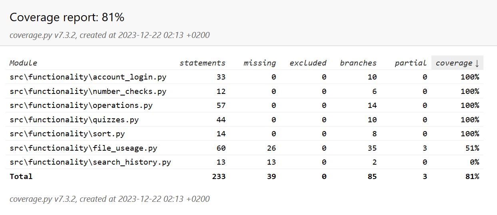

# Testing Document 

The app was tested with automatic unit and integration tests using Pytest, as well as manual system tests.

## Unit and Integration tests

### Program Logic

The automatic tests tested the files inside the `functionality` folder. The `number_theory_test` file tests the classes `FileReader`, `FileEditor`, `LoginClass`, `AccountCreation`, `EntryChecker`, `GcfClass`, `LcmClass`, `PfClass`, and `QuizClass`.

Most of these are unit tests however there are also some integration tests. Inside the  `number_theory_test` file, the `TestAccountCreation` class tests the `AccountCreation` class, parts of the `FileReader` class, as well as parts of the `FileEditor` class. Also, the `TestLogin` class tests the class `LoginClass` and parts of the `FileReader` class.

### Test Coverage

Not including the UI, the coverage is 80%.

The following situations were not tested:

- Search History string creation.
- Search History added to file.
- Search History read from file.

## System Testing

All system tests were done manually.

### Installation and Configuration

The app is downloaded and tested according to the instructions [here](https://github.com/SouperSalamander/ot-harjoitustyo/blob/main/README.md#instructions).

The application has been tested in the following situations:

- The userAccounts file was missing, and the program created it itself.
- The userAccounts file was present, and the app read it correctly.

### Functionality

All the [specification document](https://github.com/SouperSalamander/ot-harjoitustyo/blob/main/dokumentaatio/vaatimusmaarittely.md) functionality and the features listed in the [usage instructions](https://github.com/SouperSalamander/ot-harjoitustyo/blob/main/dokumentaatio/usageinstructions.md) have been tested.

All input fields have been tested with valid, invalid, and empty input.

## Remaining Issues

A very basic error message is shown when the user tries to search for the prime factors of 1. 

Since this program is intended to be used as a tool for learning, there should be more information available to the user.
