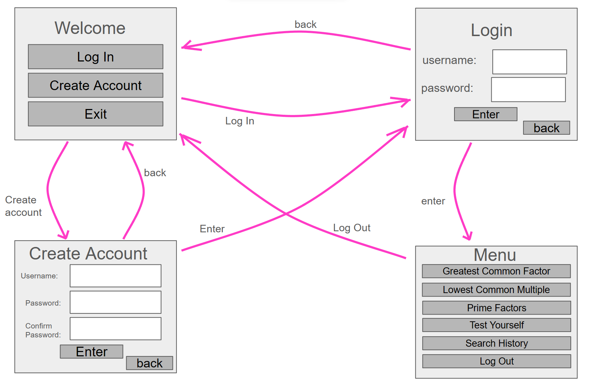

# Project Secification

## Purpose of the Application

This program will provide step by step solutions for some simple number theory problems: **Greatest Common Factor (GCF)**, **Lowest Common Multiple (LCM)**, and **Prime Factorisation**. 

## Users

There will only be one level of user which is the normal user. They will be able to access all calculators as well as their personal search history.

## Draft of User Interface

## Basic Functionality 

### Before Login

- [x] The user will be given the choice between **Log In**, **Create Account**, or **Exit**. 

- [x] If they choose to log in, they will be asked for a username and password. If this account exists the user will be taken to the main part of the program.

- [x] If they choose to create an account they will be asked to input a unique username and password. If the account already exists it will notify the user of this where they can then log in. If the account doesnt exist, it will be created and from there the user can log in.

- [x] Choosing exit will close the program.

The reason for having the user log in before using the program is so that they can access their usage history.

### After Login

- [x] The user will be given the choice between **Greatest Common Factor (GCF)**, **Lowest Common Multiple (LCM)**, **Prime Factorisation**, **Search History**, and **Log Out**. 

- [x] Choosing to log out will return the user to the welcome page.

- [x] Choosing search history will show the user their previous searches with solutions.

- [x] The other three buttons will take the user to a part of the program where they will be able to input numbers and the selected operation will be carried out. The program will then output a step by step solution.

- [x] GCF will take in two numbers and output the greatest common factor with steps.

- [x] LCM will take in two numbers and output the lowest common multiple with steps.

- [x] PF will take in one number and output the number as the product of its primes with steps.

## Ideas for Further Development

This project is one that could be easily expanded on in a variety of ways. For example, more calculator topics as well as different functionalities like quizzes and games.

- [ ] Converting recurring decimals to fractions.
      
- [ ] Percentage increase/decrease.

- [x] An area to quiz the user on these topics.

- [ ] Quiz progress could be tracked over time.
  
- [ ] There could be a competitive aspect against other users. This would be especially good in a school setting as it would really encourage young people to spend time practising these techniques.
