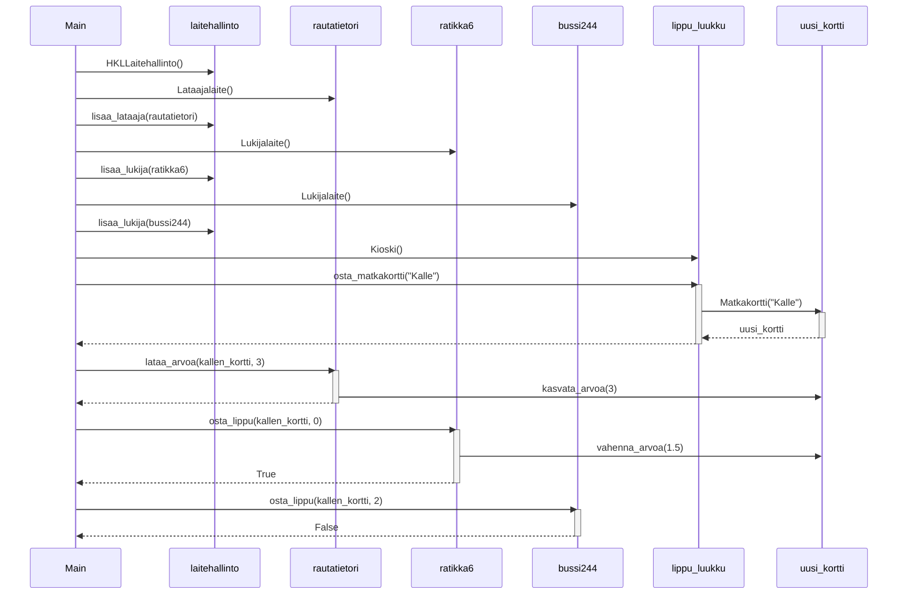

```mermaid
 sequenceDiagram
    Main ->> laitehallinto: HKLLaitehallinto()
    Main ->> rautatietori: Lataajalaite()
    Main ->> laitehallinto: lisaa_lataaja(rautatietori)
    Main ->> ratikka6: Lukijalaite()
    Main ->> laitehallinto: lisaa_lukija(ratikka6)
    Main ->> bussi244: Lukijalaite()
    Main ->> laitehallinto: lisaa_lukija(bussi244)
    Main ->> lippu_luukku: Kioski()
    Main ->> lippu_luukku: osta_matkakortti("Kalle")
    activate lippu_luukku
    lippu_luukku ->> uusi_kortti: Matkakortti("Kalle")
    activate uusi_kortti
    uusi_kortti -->> lippu_luukku: uusi_kortti
    deactivate uusi_kortti
    lippu_luukku -->> Main:    
    deactivate lippu_luukku
    Main ->> rautatietori: lataa_arvoa(kallen_kortti, 3)
    activate rautatietori
    rautatietori ->> uusi_kortti: kasvata_arvoa(3)
    rautatietori -->> Main:   
    deactivate rautatietori
    Main ->> ratikka6: osta_lippu(kallen_kortti, 0)
    activate ratikka6
    ratikka6 ->> uusi_kortti: vahenna_arvoa(1.5)
    ratikka6 -->> Main: True
    deactivate ratikka6
    Main ->> bussi244: osta_lippu(kallen_kortti, 2)
    activate bussi244
    bussi244 -->> Main: False
    deactivate bussi244
```
