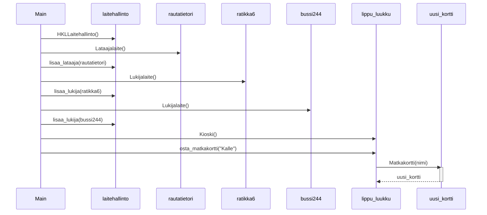

```mermaid
 sequenceDiagram
    Main ->> laitehallinto: HKLLaitehallinto()
    Main ->> rautatietori: Lataajalaite()
    Main ->> laitehallinto: lisaa_lataaja(rautatietori)
    Main ->> ratikka6: Lukijalaite()
    Main ->> laitehallinto: lisaa_lukija(ratikka6)
    Main ->> bussi244: Lukijalaite()
    Main ->> laitehallinto: lisaa_lukija(bussi244)
    Main ->> lippu_luukku: Kioski()
    Main ->> lippu_luukku: osta_matkakortti("Kalle")
    lippu_luukku ->> uusi_kortti: Matkakortti(nimi)
    activate uusi_kortti
    uusi_kortti -->> lippu_luukku: uusi_kortti
    deactivate uusi_kortti
```
