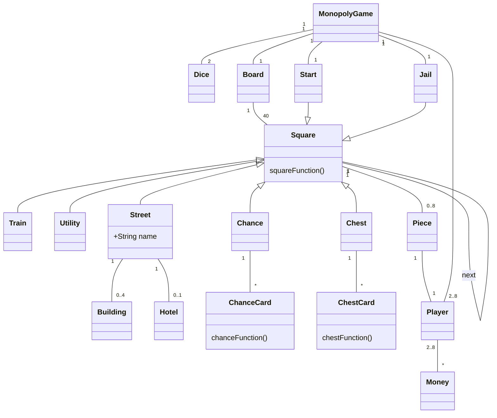

```mermaid
 classDiagram
    MonopolyGame "1" -- "2" Dice
    MonopolyGame "1" -- "1" Board
    MonopolyGame "1" -- "1" Start
    MonopolyGame "1" -- "1" Jail
    Board "1" -- "40" Square
    Start --|> Square
    Jail --|> Square
    Square "1" -- "1" Square : next
    Square <|-- Train
    Square <|-- Utility
    Square <|-- Chance
    Square <|-- Chest
    Square <|-- Street
    Street "1" -- "0..4" Building
    Street "1" -- "0..1" Hotel
    Chance "1" -- "*" ChanceCard
    Chest "1" -- "*" ChestCard
    Square "1" -- "0..8" Piece
    Piece "1" -- "1" Player
    Player "2..8" -- "1" MonopolyGame
    Player "2..8" -- "*" Money

    class Square{
        squareFunction()
    }

    class Street{
        +String name
    }

    class ChanceCard{
        chanceFunction()
    }

    class ChestCard{
        chestFunction()
    }
```
